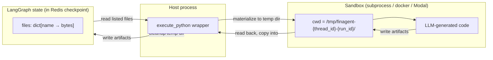

# Analytics Python execution — implementation plan

Related: [Repository README](../README.md) · [Data sandbox & internal data roadmap](./sandbox-internal-data-roadmap.md) · [Architecture overview](./architecture/README.md)

This plan details how to give the **`analytics` subagent** the ability to execute real Python code (pandas / numpy / plotly / scipy) against data fetched by `data_pull`, so the agent can do genuine numeric analysis and produce real charts — instead of emitting markdown tables that the frontend then bar-charts via heuristics.

It is the analytics-execution counterpart to the broader [data sandbox & internal data roadmap](./sandbox-internal-data-roadmap.md). That document is authoritative for: workspace isolation, isolation tiers (A/B/C), production posture, and user-uploaded files. This document plugs into those decisions and is authoritative for: the `execute_python` tool surface, analytics subagent prompts, frontend rendering of plotly outputs, and the rollout milestones to ship the capability.

---

## 1. Context — why this matters

### Today's behavior (verified against the code)

- `analytics` subagent is configured with `tools: []` in `backend/src/finagent/agent/deepagent/agent.py`. It can only format markdown.
- The "chart" that appears in chat is produced entirely on the frontend by `frontend-next/src/components/TableChart.tsx`. Every markdown table with ≥2 rows and any numeric-looking column gets a bar chart auto-attached. The Y axis is "first column to hit 60% numeric"; the X axis is "first non-numeric column." There is no axis title, no plot-type choice, and no opt-out.
- The agent has no way to express plot intent (type, axes, title, colors). So requests like *"show as a pie chart"* or *"plot profit by company over time"* cannot work.
- `backend/requirements.txt` has zero plotting libraries (no pandas, numpy, plotly, matplotlib).

### What we want

- Analytics subagent receives a workspace handle to data fetched by `data_pull` (kept **out of the LLM context** to avoid hallucination on large datasets).
- Analytics writes pandas/plotly code, calls `execute_python`, gets back artifacts (PNG / HTML / JSON / CSV).
- Frontend renders those artifacts as inline images (v1) and interactive plotly charts (v2).
- The frontend's reflexive auto-bar-chart is gated off so the agent's chosen plot is the only one shown.

### Goals (in priority order)

1. **Correct charts.** Axes match the user's actual question.
2. **Flexible plot types.** Pie, line, bar, scatter, candlestick, heatmap — driven by the user's request.
3. **No "always plot."** Charts only appear when explicitly intended.
4. **Scale beyond LLM context.** Analysis on 100k+ rows without stuffing data into prompts.
5. **Production-shaped from day one.** Sandbox boundary, per-thread isolation, bounded resources.

---

## 2. Data handoff — workspace files (with marshalling)

**Decision: Data passes from `data_pull` to `execute_python` via the agent's StateBackend file-store, with the tool wrapper doing on-disk marshalling at run time.**

### Why workspace files (not in-context, not shared memory)

- Keeps large data **out of LLM tokens** → no hallucination, no token-budget pressure.
- Reuses an existing API: deepagents' `StateBackend` already stores agent files inside the LangGraph checkpoint, and `backend/src/finagent/api/v1/routes/agent_files.py` already serves them to the frontend.
- Idempotent: same input file, same code → same result, even on agent retries.

### The marshalling step (this is the gotcha)

`StateBackend` is **not** a disk filesystem. Files live as `snapshot.values["files"][name] = bytes_or_str` inside the LangGraph state dict (verified in `agent_files.py: _state_files`). A subprocess cannot `cwd` into a Python dict.

So the `execute_python` tool wrapper has to bridge the two worlds on every call:



### Concrete contract

```
1. data_pull tool returns dict (e.g. yahoo_price_history → {"data": [...]})
2. data_pull writes via deepagents file tool: write_file("aapl_prices.json", json.dumps(result))
   → goes into state["files"]["aapl_prices.json"]
3. supervisor → analytics with context "files this turn: aapl_prices.json"
4. analytics calls execute_python(code, files=["aapl_prices.json"])
5. execute_python wrapper:
     a. mkdir /tmp/finagent-{thread_id}-{run_id}/
     b. for each name in files: read state["files"][name] → write to temp dir
     c. spawn sandbox with cwd=temp dir, timeout, memory cap, no network
     d. run code; capture stdout/stderr/exit
     e. for each NEW or MODIFIED file in temp dir: read bytes
     f. write each new artifact back into state["files"][name] via the same backend write path
     g. delete temp dir
6. Frontend's existing /v1/agent/files/{thread_id} now lists the new artifacts → chips appear
```

**Concurrency note:** the temp-dir name **must** include a `run_id` (uuid), not just `thread_id`. Two analytics calls in the same thread (parallel sub-tasks, retries) would otherwise contend on the same cwd.

---

## 3. Sandbox tier — Tier A first, designed for swap to B/C

**Decision: Tier A (guarded subprocess) for v1. Same `execute_python` interface. Swap to Tier B (Docker) or Tier C (managed: Modal / Runloop / e2b / Daytona) without touching the agent or prompts.**

### Tier comparison for *this* project

| | Tier A (subprocess) | Tier B (docker per job) | Tier C (managed sandbox) |
|---|---|---|---|
| **Isolation** | Process; OS-level resource limits | Container; full FS isolation, no network | Vendor-managed; strongest |
| **Cold start** | ~1.5s (pandas+plotly imports) | ~3–10s (image pull + boot) | ~1–3s (e2b / Modal warmpool) |
| **Per-call cost** | $0 | $0 self-hosted | ~$0.0001–$0.001/call |
| **Ops burden** | None | Image build, registry, cleanup | Account, API key, billing |
| **Multi-tenant safe** | Marginal (no real network gate on Windows) | Yes | Yes |
| **Best for** | Local dev + ~20-user demo | On-prem prod, full control | Multi-tenant SaaS |

### Why Tier A first

- Repo is currently ~20-user demo scale per the sandbox roadmap.
- pandas+plotly cold import (~1.5s) is acceptable for synchronous analytics calls; not worth the Docker/Modal overhead yet.
- Tier A → Tier B/C is a clean swap because the tool surface (`execute_python`) is the abstraction boundary. The agent never sees the difference.

### Tier C vendor shortlist (when you need it)

| Vendor | Note |
|---|---|
| **Modal** | Excellent Python ergonomics, generous free tier, called out in deepagents docs. |
| **e2b.dev** | Purpose-built for LLM-driven code interpreters; pandas/numpy/matplotlib pre-loaded; ~1s start. |
| **Runloop** | Mentioned in deepagents examples; long-running session model. |
| **Daytona** | Newer, dev-environment focus; Python supported. |

Recommendation when you outgrow Tier A: **e2b** for fastest path (it was literally built for this use case), **Modal** if you already use Modal elsewhere.

---

## 4. Tool surface

### `execute_python` (primary)

```python
@tool
def execute_python(
    code: str,
    files: list[str] | None = None,
    timeout_seconds: int = 60,
) -> dict:
    """
    Execute Python code in a guarded sandbox with pandas/numpy/plotly available.

    Args:
        code: Python source. Must be self-contained. Stdout/stderr are captured.
              Set numpy seeds for determinism. Read inputs as files in cwd.
              Write artifacts (PNG/HTML/JSON/CSV) as files in cwd.
        files: Workspace filenames to make available in cwd. Defaults to None
               (no files materialized).
        timeout_seconds: 1–120, default 60.

    Returns:
        {
          "status": "success" | "error" | "timeout" | "memory_error" | "blocked",
          "stdout": str,             # captured, truncated to 64KB
          "stderr": str,             # captured, truncated to 64KB
          "artifacts": [
            {"name": "plot.png", "mime": "image/png", "size_bytes": 45211}
          ],
          "duration_ms": 1234,
          "exit_code": int | None,
          "error": str | None        # one-line summary when status != success
        }
    """
```

### `list_workspace_files` (read-only, for the agent's situational awareness)

```python
@tool
def list_workspace_files() -> dict:
    """List files the agent has written this thread."""
    # Returns {"files": [{"name": ..., "size_bytes": ..., "mime": ...}, ...]}
```

### `read_workspace_file` (escape hatch — text only)

```python
@tool
def read_workspace_file(filename: str, max_kb: int = 256) -> dict:
    """
    Read a small text file from the workspace.

    For BINARY files (PNG, XLSX, parquet) DO NOT use this — call execute_python
    and read the file with Python instead. This tool returns text only; binary
    content will be rejected.
    """
    # Returns {"name", "size_bytes", "mime", "content_text", "truncated": bool}
```

### Validation & guards

- Filename guard: same regex as `agent_files.py` (`^[A-Za-z0-9_./\-]+$`, no `..`, length ≤ 255).
- `timeout_seconds` clamped to `[1, 120]`.
- Files materialized: max 50 per call, 100 MB total per call.
- Output artifacts: max 20 per call, 50 MB per file, 500 MB total per thread (matches sandbox roadmap).

---

## 5. Frontend rendering — static images v1, interactive plotly v2

### The auth header gotcha (verified)

`frontend-next/src/lib/api.ts` line 180–183 explicitly says:

> *"We can't use a plain `<a download>` because the backend requires the `X-User-Id` header, and anchors don't let us set headers. So: JS fetch → blob → object URL → click hidden anchor → revoke URL."*

The same restriction applies to ``. Browsers don't send custom headers on img loads. So **inline image rendering must use the same fetch→blob→objectURL pattern**.

### v1 — static PNG inline (recommended first ship)

1. Agent generates code that calls `fig.write_image("aapl_chart.png")` — plotly writes a static PNG via **kaleido** (must be in deps).
2. Tool wrapper persists the PNG into StateBackend.
3. Frontend changes:
   - In `Markdown.tsx`, recognize a sentinel like ` ```image filename.png ``` ` (or a custom marker the agent emits explicitly — never auto-detect).
   - Call a new helper `useAgentFileBlobUrl(threadId, filename)` that fetches with `X-User-Id`, creates an object URL, returns it; revokes on unmount.
   - Render `` plus a download chip from the existing chip system.
4. **Turn off** the auto bar-chart in `TableChart.tsx`. Either remove the chart block, or gate it behind a prop `<TableChart table={t} chart={false} />` and default to false. The agent's chosen plot is the only chart that appears.

### v2 — interactive plotly JSON (post-MVP)

1. Agent generates code that calls `fig.write_json("aapl_chart.plotly.json")`.
2. Tool wrapper persists JSON.
3. Frontend adds `plotly.js-dist-min` (or `react-plotly.js` if you want a thin React wrapper) — **new dependency**, ~3 MB gzipped. Worth the bytes only when interactivity earns its keep.
4. New `<PlotlyChart specUrl={...} />` component fetches the JSON via the blob path, renders via plotly's React component.

### v3 — agent emits chart-spec JSON for "small" charts (deferred)

For simple, fast cases (single bar/line/pie of ≤30 values) the agent can skip Python and emit a `{"type":"pie","x":...,"y":...}` spec that the frontend renders with recharts directly. Cheaper than spinning up a sandbox. Wire the same renderer to recognize spec blocks. **Out of scope for v1.**

---

## 6. Prompt & skill changes

### `backend/src/finagent/agent/prompt/analytics.md`

Replace with (key additions in **bold**):

```markdown
# Analytics subagent prompt

You are the **Analytics** subagent for FinAgent.

## Goal
Turn the DataPull results into a clear, professional answer. Use Python for
real numeric analysis and visualisations; never invent numbers, never
ASCII-chart, never paraphrase precise values you can compute.

## Tools
- `execute_python(code, files, timeout_seconds)` — run pandas / numpy / plotly
  / scipy / matplotlib in a sandbox. Files from data_pull are available; pass
  their names in `files`. Save outputs (PNG, HTML, JSON, CSV) to the cwd —
  they become download chips automatically.
- `list_workspace_files` — see what data_pull wrote.
- `read_workspace_file` — peek at small TEXT files. For tabular / binary,
  load them inside execute_python instead.

## When to call execute_python
Call it when the user wants:
- A specific chart type (pie, line, scatter, candlestick, etc.)
- Computed metrics (correlation, moving average, regression, ratios)
- A cleaned / merged dataset for export
- Analysis on >30 rows of data

DON'T call it for:
- 1–3 sentence factual answers
- Tiny markdown tables (≤30 cells)
- Re-formatting data the user already saw

## Code rules — STRICT
- Always set `numpy.random.seed(42)` if you sample, shuffle, or fit models.
- Read inputs from cwd by filename (e.g. `pd.read_json("aapl_prices.json")`).
- Write outputs to cwd; use descriptive names (`aapl_msft_corr.png`, not `out.png`).
- Use plotly for interactive viz; PNG via `fig.write_image("name.png")` (requires kaleido — already installed).
- Print key numbers to stdout — they come back to you for the writeup.
- Keep code idempotent. No global state, no network calls (blocked anyway).

## Output rules — STRICT
- No reasoning preamble. No "let me run a script…". Just the final answer.
- After running execute_python, briefly describe the chart (1 line) and the
  key numbers you printed. Do NOT mention file paths. Do NOT say
  "I've saved..." — the chip handles delivery.
- Use markdown tables for small tabular comparisons that don't warrant a chart.
- End with a one-line **Takeaway**.

## Hard formatting rules
- NEVER ASCII-chart (`█`, `▓`, `=`).
- NEVER put numeric data in a code fence; use a markdown table.
```

### New skill: `backend/src/finagent/agent/skills/python_analytics/SKILL.md`

Brief skill with: when to trigger, three or four canonical code snippets (load JSON → pandas, plotly bar/line/pie, correlation, CSV export). Mirrors the format of `financial_analysis/SKILL.md`. Full template lives in section 6 of the verification appendix below.

---

## 7. Security model (Tier A specifics)

### Allowlisted imports (v1)

| Library | Why |
|---|---|
| std lib: `json`, `csv`, `datetime`, `math`, `statistics`, `re`, `itertools`, `collections`, `dataclasses`, `typing` | Always safe |
| `pandas`, `numpy` | Core analysis |
| `plotly`, `plotly.graph_objects`, `plotly.express` | Primary viz |
| `matplotlib`, `matplotlib.pyplot` | Fallback static viz |
| `scipy`, `scipy.stats` | Stats / regressions |
| `kaleido` | Plotly PNG export — required, otherwise `write_image` silently fails |
| `openpyxl`, `pyarrow` | Export to xlsx / parquet |
| `Pillow` | Image save fallback |

**Blocked (raises `ImportError` in sandbox):** `os`, `sys` (writeable parts), `subprocess`, `socket`, `urllib`, `requests`, `http`, `ftplib`, `smtplib`, `multiprocessing`, `threading` (debatable), `ctypes`, `importlib`, `__import__` patching.

`scikit-learn`, `statsmodels`, `xgboost` deferred to v2 (~80MB+ each, demand-driven).

### Resource & escape limits

| Limit | Tier A enforcement |
|---|---|
| Wall time | `subprocess.Popen` + `proc.wait(timeout=…)`; **on Linux/Mac, set `start_new_session=True` and SIGKILL the whole process group** on timeout (otherwise grandchildren survive). |
| Memory | `resource.setrlimit(RLIMIT_AS, ...)` via `preexec_fn` on POSIX. **Windows: best-effort only — flag in docs and recommend Tier B for Windows prod.** |
| Network | No allowlist needed for subprocess by itself; rely on importing `socket`/`urllib`/`requests` being blocked. For real isolation, move to Tier B. |
| Filesystem | `cwd=temp_dir`; do **not** pass parent env (clear `HOME`, `TMPDIR`); cleanup the temp dir after. |
| Output size | Tool wrapper inspects temp dir post-run and refuses files exceeding caps. |
| stdout/stderr | Capture, truncate to 64 KB each before returning to the agent. |

### Code-level guards

- `ast.parse(code)`; walk and reject any `Import`/`ImportFrom` whose module is not in the allowlist, any `Attribute` access on `__builtins__`, any `Call` to `eval`/`exec`/`compile`/`__import__`.
- Reject if `ast.parse` raises (i.e. malformed code) — return clean syntax error to agent.
- Note: AST guards check **the user-submitted code only**, not what the imported libraries do internally. pandas calling `os.path` internally is fine.

### Determinism

- Pin versions in `requirements.txt`.
- Set `PYTHONHASHSEED=0` in the subprocess env (otherwise dict iteration ordering varies between runs in some pandas paths).
- Skill teaches the LLM to call `np.random.seed(42)` when sampling.

---

## 8. Errors, retries, latency

### Error contract back to the agent

```python
{
  "status": "error",
  "exit_code": 1,
  "stdout": "Loaded aapl_prices.json (252 rows)\n",
  "stderr": "KeyError: 'Adj Close'\n  at <code>:7\n",
  "error": "KeyError: 'Adj Close'",
  "duration_ms": 412,
  "artifacts": []
}
```

The agent reads `stdout` for partial progress, reads `error` for the one-liner, and can re-call `execute_python` with corrected code. Cap retries at 3 in the prompt to prevent loops.

### Latency budget for a typical "correlate AAPL & MSFT, plot it" query

| Step | Time |
|---|---|
| Supervisor decides → data_pull | ~700 ms |
| 2× Yahoo fetches (yfinance) | ~2.0–4.0 s |
| Write 2 files to StateBackend | ~50 ms |
| Supervisor decides → analytics | ~600 ms |
| Materialize files to temp dir | ~30 ms |
| Sandbox cold start + imports | ~1.5 s |
| pandas merge + corr + plotly + PNG | ~400 ms |
| Persist artifacts back | ~80 ms |
| Final answer streamed | ~600 ms |
| **Total** | **~6–10 s** |

Cold start (1.5s) dominates; a future worker pool that keeps a hot Python interpreter would cut ~1.2s. Worth it once you go beyond demo.

---

## 9. Phased rollout

### M0 — deps & sandbox skeleton (1–2 days)

- `backend/requirements.txt`: add **pinned** versions
  ```
  pandas==2.2.2
  numpy==1.26.4
  plotly==5.22.0
  kaleido==0.2.1            # NEEDED for plotly PNG export
  scipy==1.13.1
  matplotlib==3.9.0
  Pillow>=10.0
  openpyxl==3.1.5
  pyarrow==16.1.0
  ```
- `backend/src/finagent/sandbox/__init__.py`
- `backend/src/finagent/sandbox/tier_a.py` — `GuardedSubprocess.run(code, cwd, timeout, mem_mb) → result`
- `backend/src/finagent/sandbox/allowlist.py` — AST walker, import allowlist
- Unit tests for: timeout kills process group; memory cap kills; blocked import returns clean error; pandas+plotly+kaleido happy path produces a PNG.

### M1 — analytics tools wired (2–3 days)

- `backend/src/finagent/agent/tools/python_analytics.py` — `execute_python`, `list_workspace_files`, `read_workspace_file`. The wrapper does the StateBackend ↔ temp-dir marshalling described in §2.
- `backend/src/finagent/agent/deepagent/agent.py` — analytics subagent gets `tools=list(python_analytics_tools)`.
- `backend/src/finagent/agent/prompt/analytics.md` — replace per §6.
- `backend/src/finagent/agent/skills/python_analytics/SKILL.md` — new skill per §6.
- Integration test: end-to-end query *"plot AAPL closing price for last 6 months"* produces a PNG artifact visible in `/v1/agent/files`.

### M2 — frontend image rendering & auto-chart gating (2–3 days)

- `frontend-next/src/lib/api.ts` — add `useAgentFileBlobUrl(threadId, filename)` hook (fetch with X-User-Id, blob URL, revoke on unmount).
- `frontend-next/src/components/Markdown.tsx` — recognize a fenced block ` ```image filename.png ``` ` and render `` from the blob URL.
- `frontend-next/src/components/TableChart.tsx` — gate auto-chart behind `chart={false}` default. Tables stay; bar chart goes away unless explicitly opted in.
- Visual smoke: `pie chart of AAPL revenue by segment`, `correlation scatter AAPL vs MSFT`, `monthly closing line chart`.

### M3 — interactive plotly (1 week, post-MVP)

- Add `plotly.js-dist-min` to frontend `package.json` (currently has only `recharts`).
- New `PlotlyChart` component reading the agent's `*.plotly.json` artifacts via blob URL.
- Update prompt: prefer plotly JSON for ≤5k-point series; fall back to PNG for big.

### M4 — Tier B/C swap (when scale demands)

- Implement `backend/src/finagent/sandbox/tier_b.py` (docker run per call) or `tier_c_modal.py` / `tier_c_e2b.py`.
- Toggle via `SANDBOX_TIER` env var. No agent / prompt / frontend changes.

### M5 — converge with user-uploaded data path (owned by the broader [sandbox roadmap](./sandbox-internal-data-roadmap.md))

- The same `execute_python` tool serves both fetched-data analytics and uploaded-CSV analytics.
- Composer `+` upload writes into the same per-thread workspace; agent treats them identically.

---

## 10. Files to create / modify

### New

| Path | Purpose |
|---|---|
| `backend/src/finagent/sandbox/__init__.py` | Package root |
| `backend/src/finagent/sandbox/tier_a.py` | Subprocess runner |
| `backend/src/finagent/sandbox/allowlist.py` | AST checks + import gate |
| `backend/src/finagent/sandbox/marshalling.py` | StateBackend ↔ temp-dir bridge |
| `backend/src/finagent/agent/tools/python_analytics.py` | `execute_python`, etc. |
| `backend/src/finagent/agent/skills/python_analytics/SKILL.md` | Skill definition |
| `backend/tests/unit/test_sandbox_tier_a.py` | Sandbox unit tests |
| `backend/tests/integration/test_analytics_e2e.py` | End-to-end integration |
| `frontend-next/src/lib/useAgentFileBlobUrl.ts` | Auth-aware blob URL hook |

### Modified

| Path | Change |
|---|---|
| `backend/requirements.txt` | Add pandas/numpy/plotly/kaleido/scipy/matplotlib/Pillow/openpyxl/pyarrow with pinned versions |
| `backend/src/finagent/agent/deepagent/agent.py` | analytics subagent gets `python_analytics_tools` |
| `backend/src/finagent/agent/prompt/analytics.md` | Rewrite per §6 |
| `frontend-next/src/components/Markdown.tsx` | Recognize image artifact fences; render via blob URL |
| `frontend-next/src/components/TableChart.tsx` | Default chart off; keep table render |

---

## 11. Open decisions (need a call before / during M1)

| Decision | Options | Default if no answer |
|---|---|---|
| `scikit-learn` / `statsmodels` in v1? | yes / no | **No** — defer; +~80MB image |
| `kaleido` vs `orca` for plotly PNG | kaleido / orca | **kaleido** (orca is deprecated) |
| Tier B vs Tier C for production | docker self-host / Modal / e2b / Runloop | **e2b** (purpose-built); revisit at scale |
| Worker pool to amortize cold start | now / later | **Later** — accept 1.5s cold start in v1 |
| Retention of artifacts | inherit thread / hard 30-day cap | **Inherit thread** (matches roadmap) |
| sklearn allowed in sandbox? | yes / no | **No (v1)** |
| User-upload integration timing | M2 / M5 | **M5** — keeps v1 scope tight |

---

## 12. Risks & mitigations

| Risk | Severity | Mitigation |
|---|---|---|
| Subprocess timeout doesn't kill grandchildren | High | `start_new_session=True` + `os.killpg(SIGKILL)` on Linux; document Windows weakness |
| `write_image` fails silently without kaleido | High | Pin kaleido in requirements; M0 unit test calls `write_image` and asserts the PNG |
| Frontend `` 401s | High | Use blob URL pattern (§5); covered by M2 |
| Agent loops on errors | Medium | Skill caps retries at 3; surface `error` cleanly so the LLM has signal |
| OOM on 1M-row dataset | Medium | RLIMIT_AS kills cleanly; agent retries with `nrows=…` or sampling |
| Concurrent runs in same thread overwrite cwd | Medium | Per-call `run_id` UUID in temp-dir name (§2) |
| Windows memory cap is best-effort | Medium | Document; recommend Tier B/C for Windows prod |
| Agent generates `import os` for paths | Low | AST blocklist catches; clean error → agent uses pathlib (allowed std lib) |
| pandas/plotly version drift breaks code | Low | Pinned versions + integration tests in CI |

---

## 13. Out of scope (v1)

- User-uploaded CSV/Excel — owned by [`sandbox-internal-data-roadmap.md`](./sandbox-internal-data-roadmap.md) phase P0.
- SQL warehouse / internal data access — phase P3 in that roadmap.
- Real-time / streaming data.
- ML models (sklearn / statsmodels / xgboost).
- GPU.
- Multi-step agentic pipelines that chain multiple `execute_python` calls (the framework supports it; we just don't optimize for it yet).
- Agent-emitted chart-spec JSON rendered by recharts (the §5 v3 deferred path).

---

## 14. Verification pass — gotchas surfaced while reviewing this plan

These were caught by reading the actual code; folding them into the plan above. Listed here for the engineer who picks this up:

1. **StateBackend is not a disk filesystem.** Files live in `snapshot.values["files"]` as a dict (see `backend/src/finagent/api/v1/routes/agent_files.py: _state_files`). The `execute_python` wrapper must marshal: read state → write to temp dir → run subprocess → read temp dir → write back to state → cleanup. Don't assume the sandbox can `cwd` into anything the agent already wrote.

2. **Frontend can't `` directly.** `frontend-next/src/lib/api.ts:180` literally documents the constraint: backend requires `X-User-Id` header, native `` and `<a download>` can't set headers. Use fetch → blob → object URL → ``. Revoke on unmount.

3. **`kaleido` is mandatory for `fig.write_image()`.** Plotly silently fails without it. Many "I added plotly" plans miss this.

4. **`plotly.js` and `react-plotly.js` are NOT in `frontend-next/package.json`** (verified with grep — only `recharts` is). M3 must add the dependency; M2 (PNG path) deliberately doesn't need it.

5. **`subprocess.timeout` ≠ kill the whole process tree.** Use `start_new_session=True` (POSIX) and `os.killpg(pgid, SIGKILL)` on timeout. On Windows use `CREATE_NEW_PROCESS_GROUP` + `taskkill /T`.

6. **`PYTHONHASHSEED=0`** in the subprocess env stabilizes some pandas paths. Numpy seed alone doesn't cover dict iteration ordering.

7. **AST allowlist applies only to the LLM-submitted code**, not to what pandas/plotly do internally. pandas calling `os.path` is fine; the LLM writing `import os` is not.

8. **Concurrency**: include a `run_id` UUID in the temp-dir name. Two analytics calls in the same thread (parallel sub-tasks, retries) would otherwise contend.

9. **`read_workspace_file` should not return binary.** Excel/parquet/PNG via this tool would be base64-bloat in the LLM context. Restrict to text MIMEs and tell the agent to use `execute_python` for the rest.

10. **Existing `agent_files.py` already filters `call_*` tool-call payloads and dotfiles** out of the listing endpoint. New artifacts should follow normal file naming (no leading dot, no `call_…` prefix) so they actually appear as chips.

---

**Status:** Draft, ready for review. Once team agrees on §11 open decisions, kick off M0.
