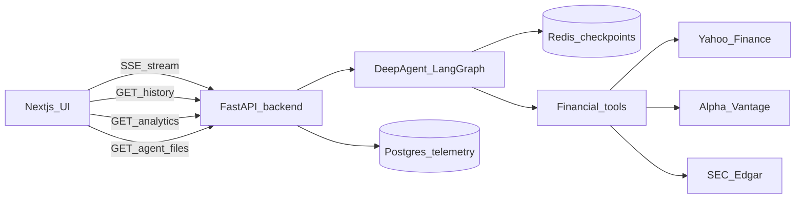
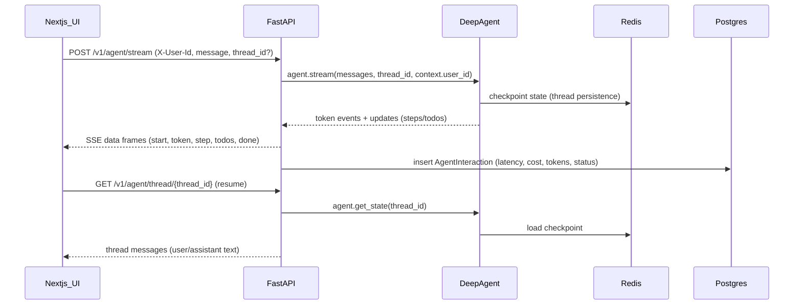
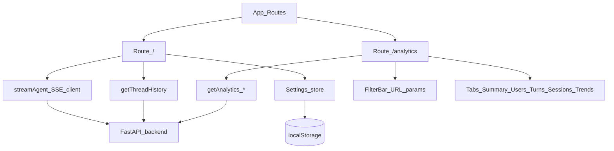

# Architecture

This section is intentionally split into **three parts** so it’s easy to navigate:

1. **Overall architecture** (end-to-end)
2. **Frontend architecture** (Next.js)
3. **Backend architecture** (FastAPI + agent runtime)

---

## 1) Overall architecture (end-to-end)



## Runtime request flow (streaming chat)



## Agent file artifacts (download flow)

Deep Agents can write files (CSV/JSON/MD reports) into the **LangGraph state** via `StateBackend`.
Those artifacts are **not on disk**, so the UI downloads them via:

- `GET /v1/agent/files/{thread_id}` (list)
- `GET /v1/agent/files/{thread_id}/{name}` (download stream)

This keeps the UX “real” (download chips) without mounting any server filesystem volume.

---

## 2) Frontend architecture (Next.js)



**Key frontend pieces (`frontend-next/`)**

- **Routes**
  - `/`: chat UI (streaming, thread resume, settings stored in localStorage)
  - `/analytics`: dashboard UI calling `/v1/analytics/*`
- **HTTP/SSE client**: `frontend-next/src/lib/api.ts`
- **State**: `frontend-next/src/lib/stores.ts` (Zustand, persisted)
- **Auth**: demo-only `X-User-Id` header (user id comes from Settings)

---

## 3) Backend architecture (FastAPI + Deep Agent)

```mermaid
flowchart TB
  App[FastAPI_app] --> AgentRoutes[/v1/agent/*]
  App --> AnalyticsRoutes[/v1/analytics/*]
  App --> FeedbackRoutes[/v1/feedback/*]
  App --> FilesRoutes[/v1/agent/files/*]

  AgentRoutes --> Agent[DeepAgent_LangGraph]
  Agent --> Redis[(Redis_checkpoints)]

  AgentRoutes --> PG[(Postgres)]
  AnalyticsRoutes --> PG
  FeedbackRoutes --> PG

  Agent --> Tools[Financial_tools]
  Tools --> Yahoo[Yahoo_Finance]
  Tools --> Alpha[Alpha_Vantage]
  Tools --> SEC[SEC_Edgar]
```

### LLM / Agent architecture (Deep Agents)

This is the **LLM flow** inside the backend: prompts + skills + subagents + tools + memory.

```mermaid
flowchart TB
  Req[User_message] --> Router[/v1/agent/stream_or_run]
  Router --> Supervisor[Supervisor_prompt_planner_md]

  Supervisor -->|delegates_task| DataPull[data_pull_subagent]
  Supervisor -->|delegates_task| Analytics[analytics_subagent]
  Supervisor -->|direct_answer| Final[Final_answer]

  DataPull --> Tools[Tool_calls]
  Tools --> Yahoo[Yahoo_Finance]
  Tools --> Alpha[Alpha_Vantage]
  Tools --> SEC[SEC_Edgar]
  Tools --> Other[Other_APIs]

  DataPull --> Facts[Structured_facts]
  Facts --> Analytics
  Analytics --> Final

  Supervisor --> Redis[(Redis_checkpoints)]
  DataPull --> Redis
  Analytics --> Redis

  Router --> SSE[SSE_tokens_steps_todos]
  SSE --> UI[Nextjs_UI]

  Router --> PG[(Postgres_agent_interactions)]
  Router --> Pricing[pricing_compute_cost]
  Pricing --> PG
```

**Where this is defined**

- **Agent graph assembly**: `backend/src/finagent/agent/deepagent/agent.py`
  - Loads prompts from `backend/src/finagent/agent/prompt/*.md`
  - Registers skills from `backend/src/finagent/agent/skills/*/SKILL.md`
  - Instantiates subagents: `data_pull` (tools enabled) and `analytics` (presentation)
- **Streaming transport (SSE)**: `backend/src/finagent/api/v1/routes/agent.py`
  - Emits: `start`, `token`, `step`, `todos`, `done`
  - Persists analytics per turn: latency, tokens, cost, status/error
- **Costing**: `backend/src/finagent/infra/config/pricing.py`
  - Uses provider usage metadata when available
  - Falls back to best-effort estimates for legacy rows

**Key backend pieces (`backend/`)**

- **App entry**: `backend/src/finagent/api/main.py`
- **Routers**
  - Agent: `backend/src/finagent/api/v1/routes/agent.py`
  - Agent files: `backend/src/finagent/api/v1/routes/agent_files.py`
  - Analytics: `backend/src/finagent/api/v1/routes/analytics.py`
  - Feedback: `backend/src/finagent/api/v1/routes/feedback.py`
- **Auth**: `backend/src/finagent/api/dependencies/auth.py` (demo tenancy by `X-User-Id`)
- **Admin allow-list**: `backend/src/finagent/api/dependencies/admin.py` via `ADMIN_USER_IDS`
- **Agent assembly**: `backend/src/finagent/agent/deepagent/agent.py` (prompts + skills + tools)
- **Prompts**: `backend/src/finagent/agent/prompt/*.md`
- **Skills**: `backend/src/finagent/agent/skills/*/SKILL.md`

---

## Storage model (shared)

- **Redis**: LangGraph checkpoints for thread persistence (`RedisSaver`)
- **Postgres**:
  - `api_requests`: request logging
  - `agent_interactions`: per-turn analytics (latency, tokens, cost, status, errors, etc.)
  - `feedback`: optional thumbs up/down

## Key design choices

- **Thread persistence**: `thread_id` is the stable key for a conversation; checkpoints live in Redis.
- **Demo auth**: `X-User-Id` is required; no JWT/session yet.
- **Costing**: uses streamed usage metadata when available; falls back to best-effort estimates for older rows.
- **Admin features**: analytics (and later knowledge base) can be gated by env allow-list without code changes.

